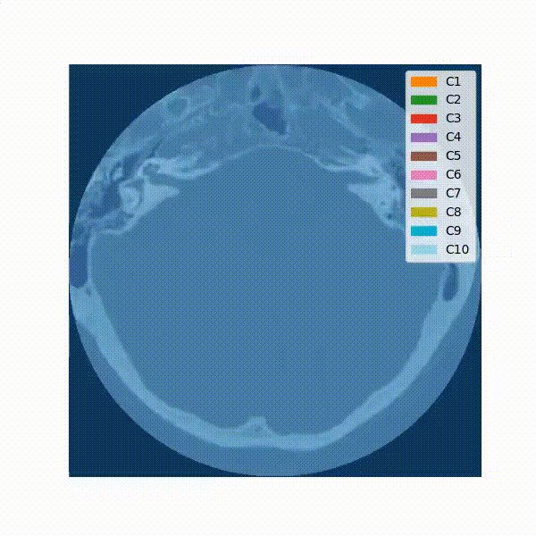

# rsna-cervical-spine

Data Science tutorial project by the Hadavand's Minions group to tackle the Kaggle project on cervical spine fracture detection.

## About The Project

Our research question is “How can we quickly detect and locate vertebral fractures in the cervical spine from CT scans to aid in the prevention of neurologic deterioration and paralysis after trauma?”. The data we are working with consists of CT scans cervical spines of patients and the goal is identify whether a given vertebrae and therefore overall patient has a fracture. We got the data from .Kaggle RSNA competition [here](https://www.kaggle.com/competitions/rsna-2022-cervical-spine-fracture-detection/data). The data consits of:


Two video walkthroughs of the image slices is shown below. The first contains plain image slices and the second contains image slices with their masks overlaird

<br>


We run exploratory analysis on the dataset and find a big class imbalance (there are way more cases with fractures than without) which helps us determine what models to choose and the metrics to evaluate. An indepth EDA can be found in the cervical_spine_eda [notebook](./notebooks/Cervical_Spine_EDA.ipynb)  within the notebook directory

We use 4 classifaction models as in this [notebook](./notebooks/RSNA_Classification.ipynb) within the notebooks directory. The Basic RNN model has the best performance. It has the lowest loss, highest AUC and F1 scores and predicts the test set accurately. The loss and accrucacy are shown below


## Tutorial Assignments

The following are the locations for the assignments done within this tutorial by the Hadavand's Minions group:

1. [Setting up your Project](./assignments/1_Project_Setup/)
2. [Exploratory_Analysis](./assignments/2_Exploratory_DA/)
3. [Final_Writeup](./assignments/3_Final_Project/)

## Project setup

The project was setup using `cookiecutter` as described in the
[project setup](./docs/projectSetup.md).

## Tools used in this project

* [Poetry](https://towardsdatascience.com/how-to-effortlessly-publish-your-python-package-to-pypi-using-poetry-44b305362f9f): Dependency management - [article](https://towardsdatascience.com/how-to-effortlessly-publish-your-python-package-to-pypi-using-poetry-44b305362f9f)
* [hydra](https://hydra.cc/): Manage configuration files - [article](https://towardsdatascience.com/introduction-to-hydra-cc-a-powerful-framework-to-configure-your-data-science-projects-ed65713a53c6)
* [pre-commit plugins](https://pre-commit.com/): Automate code reviewing formatting  - [article](https://towardsdatascience.com/4-pre-commit-plugins-to-automate-code-reviewing-and-formatting-in-python-c80c6d2e9f5?sk=2388804fb174d667ee5b680be22b8b1f)
* [DVC](https://dvc.org/): Data version control - [article](https://towardsdatascience.com/introduction-to-dvc-data-version-control-tool-for-machine-learning-projects-7cb49c229fe0)
* [pdoc](https://github.com/pdoc3/pdoc): Automatically create an API documentation for your project

## Project structure

```bash
.
├── config                      
│   ├── main.yaml                   # Main configuration file
│   ├── model                       # Configurations for training model
│   │   ├── model1.yaml             # First variation of parameters to train model
│   │   └── model2.yaml             # Second variation of parameters to train model
│   └── process                     # Configurations for processing data
│       ├── process1.yaml           # First variation of parameters to process data
│       └── process2.yaml           # Second variation of parameters to process data
├── data            
│   ├── final                       # data after training the model
│   ├── processed                   # data after processing
│   ├── raw                         # raw data
│   └── raw.dvc                     # DVC file of data/raw
├── docs                            # documentation for your project
├── dvc.yaml                        # DVC pipeline
├── .flake8                         # configuration for flake8 - a Python formatter tool
├── .gitignore                      # ignore files that cannot commit to Git
├── Makefile                        # store useful commands to set up the environment
├── models                          # store models
├── notebooks                       # store notebooks
├── .pre-commit-config.yaml         # configurations for pre-commit
├── pyproject.toml                  # dependencies for poetry
├── README.md                       # describe your project
├── src                             # store source code
│   ├── __init__.py                 # make src a Python module 
│   ├── process.py                  # process data before training model
│   └── train_model.py              # train model
└── tests                           # store tests
    ├── __init__.py                 # make tests a Python module 
    ├── test_process.py             # test functions for process.py
    └── test_train_model.py         # test functions for train_model.py
```

